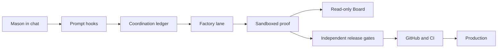

# Factory Threat Model

## Executive summary

The factory is a local, single-owner coordination system with two owner surfaces: ordinary chat and a read-only Board. Its highest risks are misleading local state, candidate-controlled proof execution, and any accidental coupling that lets a factory event replace an independent release or production gate. A repository hook cannot authenticate Mason against arbitrary code already running as his Windows account; that attacker capability is explicitly outside the pilot boundary. The governing security invariant is therefore authority monotonicity: factory state can only narrow or sequence existing authority, never create it.

## Scope and assumptions

- In scope: `scripts/factory*.mjs`, factory hooks under `.claude/hooks/`, Codex/Claude push and merge guards, factory documentation, and the local Board.
- Out of scope: CRX application runtime behavior, Supabase business data, and protection from malware or arbitrary code already executing as Mason's Windows user.
- Confirmed product constraint: exactly two owner surfaces—chat input/decisions and one read-only Board; no PIN, Windows Hello, form, command, or separate owner app.
- Assumption: Mason controls the workstation account and the chat clients; repository code and generated job content may be wrong or hostile.
- Open question: multi-user or remotely hosted operation would invalidate the same-user assumption and requires platform-authenticated identity plus stronger isolation before use.

## System model

### Primary components

- Chat prompt hooks detect factory intent and record operational decisions (`.claude/hooks/ship-intent-reminder.mjs`, `.claude/hooks/factory-owner-input.mjs`).
- The local state library stores immutable tickets, a hash-chained event ledger, receipts, and evidence under Git's common directory (`scripts/factory-state-lib.mjs`).
- The lane guard restricts supported tool operations during a job (`.claude/hooks/factory-lane-guard.mjs`).
- Sandboxed harness and Sol/high review paths attach exact-content evidence (`scripts/factory-state-lib.mjs`, `scripts/write-codex-push-proof.mjs`).
- Existing push, PR-merge, CI, migration, deploy, and live-action gates remain authoritative (`.claude/hooks/codex-push-guard.mjs`, `.claude/hooks/pr-merge-guard.mjs`, `.codex/hooks/production-action-guard.mjs`, `.claude/hooks/migration-apply-guard.mjs`).
- The Board projects read-only job state on loopback (`scripts/factory-board.mjs`).

### Data flows and trust boundaries

- Mason chat → prompt hook: prompt text and chat metadata over hook JSON; exact-question and session checks reduce ambiguity, but there is no documented platform signature.
- Prompt/lane hooks → local ledger: canonical JSON files and keyed hook-origin receipts; validates structure, ordering, hashes, expiry, and transitions, but is not same-account human authentication.
- Candidate checkout → disposable harness/reviewer: tracked and non-ignored bytes copied into isolated workspaces; credentials and host Git metadata are excluded.
- Factory state → release guards: optional additional exact-byte restrictions only; independent risk classification, Sol proof, CI, branch protection, and production rules still decide the action.
- Ledger/evidence → Board: read-only loopback HTTP projection; state-changing methods and controls are absent.

The independent-review prompt deliberately couples its same-Windows-user limitation to authority
monotonicity. A reviewer may dismiss same-user hook imitation as outside this pilot only while it
also verifies that factory state cannot weaken or replace push, merge, CI, deployment, migration,
live-data, secret, permission, or destructive-action gates. Removing either half invalidates the
threat-model exception and must be treated as a blocker.

#### Diagram

## Assets and security objectives

| Asset | Why it matters | Security objective (C/I/A) |
|---|---|---|
| Mission ticket and job state | Prevents accidental scope drift and misleading status | I/A |
| Harness and Sol receipts | Supports evidence-backed owner review | I/A |
| Repository and Git history | Candidate bytes must remain exact through landing | I/A |
| Credentials and ignored files | Must not enter candidate harnesses, reviews, or Board artifacts | C |
| Independent release gates | Prevents local coordination state from becoming production authority | I/A |

## Attacker model

### Capabilities

- Candidate-controlled tracked files, scripts, tests, and diff text may be malicious.
- An agent may make mistakes, choose ambiguous commands, or attempt supported-tool indirection.
- Local ledger files may be interrupted, stale, or accidentally tampered with.
- Loopback Board inputs include untrusted ticket, summary, and evidence labels.

### Non-capabilities

- The pilot does not defend against arbitrary code already executing with Mason's Windows-user filesystem and process authority.
- Factory state does not carry GitHub, Vercel, Supabase, secret-management, or destructive-action authority.
- A remote unauthenticated user cannot directly reach the loopback-only Board under the intended deployment model.

## Entry points and attack surfaces

| Surface | How reached | Trust boundary | Notes | Evidence |
|---|---|---|---|---|
| Owner prompt hook | Chat submission JSON | Chat client to repository hook | Exact-question binding; no platform-signed user token | `.claude/hooks/factory-owner-input.mjs` / `main` |
| Factory CLI | Permit-bound supported command | Agent tool to ledger writer | Operational transition broker, not identity provider | `scripts/factory.mjs` / `runFactoryCli` |
| Lane guard | Every supported tool call | Agent action to governed checkout | Narrows visible edits and commands | `.claude/hooks/factory-lane-guard.mjs` |
| Harness/reviewer | Evidence command | Candidate bytes to isolated process | Must exclude credentials, network, and host Git metadata | `scripts/factory-state-lib.mjs` / `runHarnessEvidence` |
| Landing guards | Push or PR merge | Local candidate to GitHub/production | Factory validation must only add restrictions | `.codex/hooks/production-action-guard.mjs` / `gatePullRequestMerge` |
| Board HTTP server | Loopback GET/HEAD | Ledger to owner display | Escaped, projected, read-only output | `scripts/factory-board.mjs` / `createFactoryBoardServer` |

## Top abuse paths

1. Misleading approval: same-account code invokes the prompt hook with synthetic JSON → local approval state advances → Board becomes misleading. Impact is bounded to coordination because independent release gates remain authoritative; same-account human authentication is out of scope.
2. Authority coupling: a future guard treats `approved-to-land` as sufficient → skips independent risk/proof/CI rules → unsafe bytes can reach production. This is the principal blocker-class factory threat.
3. Candidate proof escape: a repository harness inherits credentials, network, or host Git metadata → exfiltrates secrets or mutates shared state → evidence is untrustworthy.
4. Evidence drift: reviewed bytes change after proof → stale receipt is reused → owner sees proof for different behavior. Exact repository fingerprints and current-base checks must reject it.
5. Board injection: malicious ticket/summary text reaches HTML → script executes in the Board origin. Context escaping and a restrictive content-security policy mitigate it.
6. Ledger corruption: torn or reordered events replay as valid → job advances incorrectly. Canonical serialization, hash chaining, legal transitions, and degraded-tail handling mitigate honest corruption.

## Threat model table

| Threat ID | Threat source | Prerequisites | Threat action | Impact | Impacted assets | Existing controls (evidence) | Gaps | Recommended mitigations | Detection ideas | Likelihood | Impact severity | Priority |
|---|---|---|---|---|---|---|---|---|---|---|---|---|
| TM-001 | Same-Windows-user process | Code already runs as Mason's account | Synthesizes hook input or rewrites local state | Misleading local approval/Board | Ticket and job state | Exact question/session/transition checks and hook-origin receipt (`factory-owner-input.mjs`, `factory-state-lib.mjs`) | Cannot authenticate the human at this boundary | Keep explicitly coordination-only; require a new authenticated broker before shared/hostile deployment | Surface authority model on Board and in receipts | Medium | Medium | medium |
| TM-002 | Future factory/guard change | Factory state is trusted by a release path | Treats approval as sufficient authority | Unsafe production landing | Independent release gates | Current push/merge guards continue into risk, proof, CI, and production checks | Cross-file invariant could regress | Keep authority-monotonicity tests and exact-SHA Sol/high review on governance paths | Fail CI if guard order or independent checks disappear | Low | High | high |
| TM-003 | Malicious candidate harness | Candidate code executes during proof | Escapes workspace or receives secrets/network | Credential theft or host mutation | Credentials, repository, evidence | Disposable workspace, no inherited credentials/network, fixed harness allowlist (`factory-state-lib.mjs`) | Docker/runtime availability is operationally external | Retain hermetic execution and emergency hold on host drift | Hash host state before/after; log sandbox denials | Low | High | high |
| TM-004 | Stale or modified candidate | Proof exists for earlier bytes | Reuses proof after content/base drift | False acceptance | Evidence, repository | Content fingerprints, ticket scope, current-base checks, exact-SHA review | Moving main forces repeated review | Keep commit/PR head-base binding and re-present on drift | Board warning and proof invalidation event | Medium | High | high |
| TM-005 | Untrusted display text | Malicious ticket or evidence label | Injects active HTML/script | Misleads owner or reads Board state | Board integrity | HTML escaping, CSP, loopback binding, no forms (`factory-board.mjs`) | Same-user local process can still read loopback | Preserve escaping/CSP regression tests | Browser CSP violation logging if later hosted | Low | Medium | low |
| TM-006 | Crash or accidental edit | Partial or reordered ledger write | Corrupts replay state | Work stalls or wrong stage | Ledger availability/integrity | Exclusive writer lock, canonical JSON, hash chain, legal transitions, torn-tail recovery (`factory-state-lib.mjs`) | Hash chain lacks external anchor | Keep backup-first recovery; consider off-device checkpoints before multi-lane | Alert on degraded/recovery state | Medium | Medium | medium |

## Criticality calibration

- Critical: factory state alone can deploy, apply live SQL, delete data, expose secrets, or bypass protected-main controls; authenticated remote code execution in a future hosted Board.
- High: stale/unreviewed bytes can merge; candidate proof code escapes isolation; factory approval disables or replaces Sol/CI/production checks.
- Medium: local coordination state or Board can be misleading without crossing an independent production boundary; recoverable ledger corruption parks work.
- Low: low-sensitivity loopback metadata exposure, display defects blocked by CSP, or noisy local availability failures with safe recovery.

## Focus paths for security review

| Path | Why it matters | Related Threat IDs |
|---|---|---|
| `scripts/factory-state-lib.mjs` | Ledger, receipts, transitions, fingerprints, sandboxing | TM-001, TM-003, TM-004, TM-006 |
| `.claude/hooks/factory-owner-input.mjs` | Converts chat JSON into coordination decisions | TM-001 |
| `.claude/hooks/factory-lane-guard.mjs` | Enforces supported-tool lane restrictions | TM-001, TM-002 |
| `.claude/hooks/factory-state-integrity-guard.mjs` | Protects local factory state from ordinary tool mistakes | TM-001, TM-006 |
| `scripts/write-codex-push-proof.mjs` | Creates the independent exact-SHA review packet and charter | TM-002, TM-003, TM-004 |
| `.claude/hooks/codex-push-guard.mjs` | Must retain independent risky-push proof checks | TM-002, TM-004 |
| `.claude/hooks/pr-merge-guard.mjs` | Must retain GitHub head/base, CI, and proof checks | TM-002, TM-004 |
| `.codex/hooks/production-action-guard.mjs` | Blocks live/deploy actions and independently gates landing | TM-002 |
| `.claude/hooks/migration-apply-guard.mjs` | Live SQL gate must remain independent of factory state | TM-002 |
| `scripts/factory-board.mjs` | Owner-visible proof projection and HTML boundary | TM-001, TM-005 |

## Quality check

- Covered the discovered owner hook, CLI, lane, proof, landing, migration, and Board entry points.
- Represented each trust boundary in at least one threat.
- Separated local development automation from CRX application runtime and production controls.
- Reflected Mason's confirmed two-touchpoint constraint and the resulting coordination-only authority model.
- Kept the shared/hostile-workstation case explicit as an unsupported deployment that requires redesign.
