# Governed Autonomous Software Factory

## What Mason experiences

The factory has exactly two owner touchpoints:

1. **Input: ordinary Claude or Codex chat.** Mason describes a job in plain English. The session turns it into a mission ticket and asks one plain-English yes/no question. For money or other high-risk work, the ticket includes a worked business example and a forbidden outcome. Mason's exact reply is recorded with its timestamp.
2. **Output: one read-only Factory Board.** Each job shows its title, stage, behavior result, blocker, and attached proof. The board has no controls. Accept, reject, pause, resume, and revision decisions happen back in chat.

Mason never runs a command, edits a ticket, reads a diff, or operates a separate factory app.
“Run the factory overnight” and similarly direct execution language records factory intent on its own;
questions that merely discuss or explain the factory do not.

## What happens underneath

Claude and Codex resolve `git rev-parse --git-common-dir` to one absolute path and share:

- immutable, content-hashed ticket files;
- one append-only, hash-chained event ledger;
- copied, content-hashed proof files.

The state lives under `<git-common-dir>/crx-factory/`, so every worktree and both tools see the same queue. An incomplete final ledger line is shown as degraded and cannot advance a job. An interior malformed line, broken hash chain, duplicate event, changed ticket, expired approval, moved `origin/main`, or missing session binding fails closed. Critical decisions first fetch `origin/main`; they do not treat a previously fetched local pointer as current.

Only the canonical `scripts/factory.mjs` process and the owner-routing hooks may call the state writer.
The library checks the invoked entrypoint and real call stack; pre-tool guards also block direct state
paths, factory-internal imports, inline code execution, and governance self-edits in an active lane.
Every mutating CLI call additionally consumes a 30-second, single-use permit minted by the real
PreToolUse hook from that tool call's actual chat identity. Agent-supplied `--session`, `--tool`, or
permit values cannot create or override identity, and the permit-minting hook cannot be launched as
an agent command. The permit also records the exact terminal ledger hash seen by the hook. Command
handling and the final append both fail if any intervening event changes that checkpoint.
These are defense-in-depth controls inside the supported Claude/Codex tool model, not a cryptographic
security boundary against another arbitrary process running as Mason's Windows account. The hash chain
detects accidental/torn/tampered history when the reader has an honest prior hash; it does not provide
authenticity against a same-user program that rewrites the whole ledger. Therefore the ledger and Board
are operational coordination/audit surfaces, never authority to merge, deploy, migrate, alter live data,
or bypass `/ship`, GitHub review, branch protection, and production approval gates. Installing this pilot
on a shared or hostile workstation is out of scope. The supported commands are agent-facing implementation
details, not owner interfaces.

If Mason changes his mind before a ticket exists, he says “never mind the factory” or asks for the
normal workflow in chat. The real owner-input hook clears that chat's intent. There is no agent-facing
intent-clear command. Once a ticket or lane exists, Mason rejects the ticket or parks the job in chat.

## Job flow

```mermaid
flowchart LR
  A["Mason describes work in chat"] --> B["Session drafts mission ticket"]
  B --> C["Exact ticket question"]
  C -->|Exact yes in same chat| D["Approved and queued"]
  C -->|No or qualified yes| P["Rejected or revise"]
  D --> E["Deterministic lane-start guard"]
  E --> F["Existing /ship build and proof"]
  F --> G["Independent review"]
  G --> H["Factory Board: ready for review"]
  H --> I["Exact morning decision in chat"]
  I -->|Accept| J["Approved to enter /ship landing gates"]
  I -->|Reject or revise| P
  J --> K["Existing commit, PR, production, and live gates"]
```



An acceptance never means “live.” It means the job may enter the existing `/ship` landing gates. Production deployments, live database changes, destructive actions, secrets, permissions, and other existing hard gates remain unchanged.

Pause and resume are owner-only controls. Mason says them in ordinary chat. The agent CLI has no
hold/resume command, the trusted owner-input hook cannot be launched as an agent command, and wording
about stopping or restarting the Factory Board changes only the Board process—not the global hold.
Only explicit `resume` or `restart` language lifts a hold; a sentence about continuing work later does not.

## Exact approval rule

An approval is valid only when all of these are true:

- exactly one decision is pending in that chat;
- the immediately preceding assistant message in the transcript is byte-for-byte the stored question after newline normalization;
- the ticket question is generated deterministically from the immutable ticket and includes its goal, done conditions, prohibitions, exact allowed repository paths, proof, delivery gate, and high-risk example/forbidden outcome;
- the morning question is generated deterministically from the exact behavior summary, harness receipts, independent-review receipt, and ticket hash, and says explicitly that acceptance is not landing or production;
- Mason replies with an unqualified `yes`, `approved`, `approve it`, `go ahead`, or `do it`;
- the session identifier matches; build-stage and evidence changes stay bound to the lane-start session;
- for a mission ticket, a fresh `git fetch origin main` still matches the recorded base and the receipt has not expired after 24 hours.

“Yes, but…”, “yes, except…”, or similar language is a revision request. A reply in another tool or a
new chat does not carry over. Mason may explicitly ask the new chat to take over the named factory
job; only that real owner-prompt hook may transfer custody, and it revokes the old approval/question
fingerprint before the ticket or morning decision is re-presented there.

## Pilot limits

- One factory custody window at a time. From ticket drafting/presentation through queued, build,
  verification, independent review, and the morning decision, build writes
  and opaque helper execution from every other chat are denied, including fresh chats with no prior
  factory intent. Native editing,
  MCP filesystem tools, shell file commands, redirects, Git mutation, and unknown repository scripts
  all count as writes. Inside the active lane, source changes use structured Write/Edit/apply_patch
  calls whose targets are visible to the guards. Every target is canonicalized and must stay inside
  the worktree, avoid `.git`, ignored and secret-bearing paths, resolve through no escaping symlink,
  and match an exact file or directory prefix approved in the ticket. Hidden or out-of-ticket targets
  fail closed. Opaque shell writers, generated helper scripts, and
  MCP process launchers are denied; read commands remain available, and fixed verification harnesses
  run only through the permit-bound `factory.mjs evidence run` broker. Git inspection uses a strict
  subcommand/token/option allowlist: output-writing, external-diff/text-conversion, paging/config
  injection, and unknown flags are mutations. Unknown non-shell tools default to opaque execution;
  only explicit structured read-only tools are exempt. Structured reads and simple shell reads must
  stay inside the worktree and cannot target ignored or secret-bearing paths; dynamic, parent-relative,
  wildcard shell paths, PowerShell providers/drives, literal CR/LF command chaining, alternate
  item/property/ACL writers, and secret-shaped added content fail closed.
  Shell `rg` is not exempt because
  its preprocessing/hostname options can execute programs; agents use the structured Grep tool instead.
- During governed operation, any explicit shell `cwd` or `workdir` must resolve to the exact
  governed repository root. Recognized factory commands are rewritten to the canonical absolute
  `scripts/factory.mjs` broker path before a permit or read-only status execution is allowed.
- A lane starts only from a clean checkout whose `HEAD` is the exact approved `origin/main` SHA.
  Before evidence acceptance, owner review, and closeout, the factory recomputes committed,
  working-tree, and untracked paths from that base and rejects any path outside the ticket.
- Independent Sol review never runs in the host checkout. Trusted bootstrap creates a disposable,
  Git-free packet containing exact base bytes, tracked/non-ignored candidate bytes, a precomputed
  diff with fixed relative snapshot headers, and a SHA manifest. Packet regression checks reject
  source-checkout, temporary review-root, or user-profile paths. Ignored files, factory session
  state, host profile paths, and repository Git metadata are not exposed to the reviewer.
- The authoritative factory CLI, state broker, read-only Board, and `package.json` test wiring are
  all risky/protected trust-chain surfaces. A governed lane cannot rewrite them, and any later
  publication that changes them requires a fresh exact-SHA Sol/high review.
- Factory-intent routing writes a separate per-session failure latch before the shared ledger. If
  ledger append fails, build writes and mutating factory commands stay blocked until recovery and
  successful owner-prompt re-submit clears the latch. The owner text is secret-scanned before any
  persistence; the latch stores only its SHA-256 and rejection flag, never the raw prompt.
- Governed Git reads cannot redirect to another checkout with `git -C`; shell-read operands are
  individually checked for containment, ignored/secret paths, and symlink escape. Exact repository
  fingerprints bind Git mode and object type as well as path and blob bytes.
- Permit-bound factory commands never read caller-selected files. Ticket JSON and short
  summary/blocker/recovery text travel as bounded canonical base64; secret-shaped operational text
  is rejected before it can enter the ledger or board.
- A job becomes `live` only when the newest GitHub Production deployment has a newest status of
  `success` and GitHub compare proves its deployed SHA is the recorded landing commit or a
  descendant. Historical success followed by `inactive`, or a rollback to an older SHA, fails
  closed even when the canonical URL still returns HTTP 200.
- The board binds only to loopback and is read-only.
- A global hold clears only on an unambiguous affirmative owner resume/restart phrase; negated
  phrases such as “do not resume” leave the hold active.
- The first pilot stops before commit unless Mason separately authorizes the ordinary landing step.
- Multi-lane execution stays disabled until the single-lane pilot demonstrates honest evidence, bounded cost, safe pause/resume, and no unsupported completion claims.

## Operator recovery

Before morning review, the agent must run every repository-owned npm harness named in the immutable
approved ticket through `factory.mjs evidence run`. The harness must also be in the factory's fixed
allowlist (`test`, `test:factory`, `test:agent-workflows`, `typecheck`, `lint`, `build`,
`verify-deps`, or `check-doc-drift`) and its script body must still equal `origin/main`. The CLI
captures and hashes the name, resolved script body, package file, base SHA, zero exit, output, and a
content fingerprint covering every tracked and non-ignored repository file. In production, the
broker builds a pinned Docker dependency layer from `origin/main` with install scripts disabled.
The harness receives no inherited credentials, no network, no Linux capabilities, a read-only root
and dependency layer, bounded resources, and only a disposable workspace copied from tracked and
  non-ignored repository bytes. Trusted bootstrap creates a new sanitized Git repository inside that
  disposable volume, then removes the shared Git-directory mount before branch-controlled harness code
  starts. The original checkout, ignored files, other worktrees, shared factory state, and shared Git
  metadata/objects are unavailable to the harness process. The broker verifies that repository and shared factory state stayed frozen, deletes the
disposable workspace, emergency-holds on detected indirect host mutation, and refuses secret-shaped
harness output before it can become a Board artifact. It rechecks the repository fingerprint before
morning review and closeout, so later source or test edits invalidate stale proof. A separate trusted
Codex executable then performs a fixed-prompt, read-only review. The prompt includes the complete
canonical approved ticket and its hash. The process receives only a small operating-system/tool-path
environment allowlist, not inherited API, Supabase, GitHub, or application credentials. It runs
ephemerally with user plugins/MCP configuration disabled and explicit `gpt-5.6-sol` / high reasoning.
Its unique
terminal CLEAN verdict, model, fresh base, and complete repository-content fingerprint are persisted;
raw stdout/stderr are not—the receipt stores a bounded summary, byte counts, and hashes. A later commit
may change Git's commit/tree identifiers while preserving the exact reviewed file fingerprint; any
file-byte change still invalidates the review. A passing branch-controlled harness without this
independent verdict cannot reach morning review.
Morning presentation reruns both harness and independent-review validation and requires the original
base to remain current after a fresh fetch. Once Mason accepts, factory custody ends and the ordinary
`/ship` commit/PR guards become authoritative. After landing, closeout validates proof against the
job's immutable original base, proves that the landing commit is contained in current `origin/main`,
and computes the commit's own tree/content fingerprint. The landing commit must contain the exact
bytes that passed the accepted harness. Harness and independent-review artifacts are reopened and
re-hashed from the shared evidence store before morning review and closeout; commit-bound closeout
reads the harness script wiring from that frozen landing commit, not the mutable caller checkout.
The CLI has no arbitrary
local-file evidence route. Production verification is performed by the trusted broker: GitHub must
report a successful `Production` deployment for the exact landing SHA and the fixed canonical app URL
must answer HTTP 200 without a redirect. Caller-supplied production prose is neither accepted nor
persisted. The persistence scan still covers every ticket and ledger payload, including raw JWT/Supabase-key
shapes and common GitHub, AWS, Google, Slack, Stripe, named-password, API-key, and access-token forms.

Closeout is retry-safe and two-phase. The first call machine-verifies production and prepares a
deterministic packet containing the approved base, landing commit, proof and review manifests, and
pre-closeout ledger checkpoint. The job remains `approved-to-land`. If a lock or ledger interruption
happens after the packet is created, the next call reuses the byte-identical packet. A later call can
record `live` only after the exact packet bytes are committed into `origin/main`; it rechecks the
exact-SHA deployment and canonical URL first and records the packet-containing commit. Conflicting
packet or landing retries fail closed; retrying a completed closeout returns the already-recorded
packet without appending another `live` event.
All mutating factory commands use the permit's expected-last-event hash under the same exclusive
writer lock, so two simultaneous starts or a stale presentation/revision command cannot both pass an
older snapshot. The CLI and ledger replay independently enforce current session custody and eligible
ticket/review transitions.

If the ledger cannot record Mason's plain-English pause, the owner hook writes a separate emergency
hold marker that the lane guard reads before another build mutation. The hold remains until recovery
and Mason's later resume.

If factory state cannot be verified, repository mutations fail closed. Reads remain available for
diagnosis, and the canonical factory status/recovery CLI remains reachable. A corruption that cannot
be repaired by the backup-first stale-lock or torn-tail modes remains parked for an owner recovery
decision; it does not brick unrelated read-only work.

Do not edit or delete a lock or ledger by hand. Use the validated agent-facing recovery route:

```
node scripts/factory.mjs recover unlock --reason-base64 <base64-plain-text-reason>
node scripts/factory.mjs recover torn-tail --reason-base64 <base64-plain-text-reason>
```

Unlock refuses locks younger than five minutes or owned by a live process and preserves a backup.
Torn-tail recovery refuses a locked ledger, archives the original bytes, and removes only its
incomplete final line before recording a recovery event.

Closed-job audit packets must be committed under `docs/audits/factory/jobs/` before a job can be
described as durably closed. Add the shared active-state directory to the off-site backup inventory
before enabling multiple lanes.

The Board's `/api/state` response is also an owner projection: it omits chat/lane session identifiers,
approval internals, ticket contents, and proof base hashes.
