# Governed Autonomous Software Factory

## What Mason experiences

The factory has exactly two owner touchpoints:

1. **Input: ordinary Claude or Codex chat.** Mason describes a job in plain English. The session turns it into a mission ticket and asks one plain-English yes/no question. For money or other high-risk work, the ticket includes a worked business example and a forbidden outcome. Mason's exact reply is recorded with its timestamp.
2. **Output: one read-only Factory Board.** Each job shows its title, stage, behavior result, blocker, and attached proof. The board has no controls. Accept, reject, pause, resume, and revision decisions happen back in chat.

Mason never runs a command, edits a ticket, reads a diff, or operates a separate factory app.
“Run the factory overnight” and similarly direct execution language records factory intent on its own;
questions that merely discuss or explain the factory do not.

## What happens underneath

Claude and Codex resolve `git rev-parse --git-common-dir` to one absolute path and share:

- immutable, content-hashed ticket files;
- one append-only, hash-chained event ledger;
- copied, content-hashed proof files.

The state lives under `<git-common-dir>/crx-factory/`, so every worktree and both tools see the same queue. An incomplete final ledger line is shown as degraded and cannot advance a job. An interior malformed line, broken hash chain, duplicate or unknown event, illegal stage transition, changed ticket, missing hook-origin receipt, expired approval, moved `origin/main`, or actor/session binding mismatch fails closed. Critical decisions first fetch `origin/main`; they do not treat a previously fetched local pointer as current.

Only the canonical `scripts/factory.mjs` process and the owner-routing hooks may call the state writer.
The library checks the invoked entrypoint and real call stack; pre-tool guards also block direct state
paths across recursively inspected structured-tool arguments, direct state reads, Git `--git-path`
indirection, factory-internal imports, inline code execution, and governance self-edits in an active lane.
Every mutating CLI call additionally consumes a 30-second, single-use permit minted by the canonical
PreToolUse hook from that tool call's actual chat identity. Agent-supplied `--session`, `--tool`, or
permit values cannot create or override identity inside the supported tool route. The permit also records the exact terminal ledger hash seen by the hook. Command
handling and the final append both fail if any intervening event changes that checkpoint.
Chat-decision events are additionally written with a random, write-once hook-origin receipt under the private permit
area. Its keyed HMAC-SHA-256 integrity code binds the complete event core and prior ledger hash; the ordinary CLI broker
does not mint it. Replay verifies that receipt plus the exact legal prior stage, ticket, question, base,
actor, session, expiry, and decision payload before any owner decision changes operational state.
A copied or synthesized event/receipt pair without the private installation key is rejected.
The receipt proves that the canonical hook produced the record; it does not prove that Mason, rather
than another process already running as his Windows account, supplied the event. These are
defense-in-depth controls inside the supported Claude/Codex tool model, not a cryptographic security
boundary against another same-user process. The hash chain
detects accidental/torn/tampered history when the reader has an honest prior hash; it does not provide
authenticity against a same-user program that rewrites the whole ledger. Therefore the ledger and Board
are operational coordination/audit surfaces. Factory approval only narrows and sequences reversible
work already authorized by Mason's request and repository policy; it never creates new authority to
push, merge, deploy, migrate, alter live data,
or bypass `/ship`, GitHub review, branch protection, and production approval gates. Installing this pilot
on a shared or hostile workstation is out of scope. The supported commands are agent-facing implementation
details, not owner interfaces.

If Mason changes his mind before a ticket exists, he says “never mind the factory” or asks for the
normal workflow in chat. The real owner-input hook clears that chat's intent. There is no agent-facing
intent-clear command. Once a ticket or lane exists, Mason rejects the ticket or parks the job in chat.

## Job flow

```mermaid
flowchart LR
  A["Mason describes work in chat"] --> B["Session drafts mission ticket"]
  B --> C["Exact ticket question"]
  C -->|Exact yes in same chat| D["Approved and queued"]
  C -->|No or qualified yes| P["Rejected or revise"]
  D --> E["Deterministic lane-start guard"]
  E --> F["Existing /ship build and proof"]
  F --> G["Independent review"]
  G --> H["Factory Board: ready for review"]
  H --> I["Exact morning decision in chat"]
  I -->|Accept| J["Approved to enter /ship landing gates"]
  I -->|Reject or revise| P
  J --> K["Existing commit, PR, production, and live gates"]
```



An acceptance never means “live” and never becomes a security credential. It means the coordination state may advance to the existing `/ship` landing gates. Those gates still make their own decision from exact bytes, Sol/high proof, GitHub state, CI, and the standing production rules. Production deployments, live database changes, destructive actions, secrets, permissions, and other existing hard gates remain unchanged.

Pause and resume are chat-only owner controls in the supported workflow. Mason says them in ordinary chat. The agent CLI has no
hold/resume command, and wording
about stopping or restarting the Factory Board changes only the Board process—not the global hold.
Only explicit `resume` or `restart` language lifts a hold; a sentence about continuing work later does not.
Pause/resume state evaluation and its conditional append share the ledger writer lock. If the chat
client reconnects or replays the same resume prompt after the factory is already running, the
owner-input hook reports an idempotent no-op and appends no duplicate ledger event. A newer opposite
control cannot be lost behind a stale no-op check.

## Exact operational approval rule

An approval is valid only when all of these are true:

- exactly one decision is pending in that chat;
- the immediately preceding assistant message in the transcript is byte-for-byte the stored question after newline normalization;
- the ticket question is generated deterministically from the immutable ticket and includes its goal, done conditions, prohibitions, exact allowed repository paths, proof, delivery gate, and high-risk example/forbidden outcome;
- the morning question is generated deterministically from the exact behavior summary, harness receipts, independent-review receipt, and ticket hash, and says explicitly that acceptance is not landing or production;
- Mason replies with an unqualified `yes`, `approved`, `approve it`, `go ahead`, or `do it`;
- the session identifier matches; build-stage and evidence changes stay bound to the lane-start session;
- for a mission ticket, a fresh `git fetch origin main` still matches the recorded base and the receipt has not expired after 24 hours.

This rule protects against ambiguity, stale state, and ordinary agent mistakes. It is not user
authentication against arbitrary same-account code. The authority-monotonicity rule is the hard
design invariant: no factory event can replace or weaken an independent release, production,
migration, live-data, secret, permission, or destructive-action gate.

“Yes, but…”, “yes, except…”, or similar language is a revision request. A reply in another tool or a
new chat does not carry over. Mason may explicitly ask the new chat to take over the named factory
job; the canonical owner-input hook records the transfer and revokes the old approval/question
fingerprint before the ticket or morning decision is re-presented there.

## Pilot limits

- Up to three factory lanes may be active at once. Only `building`, `verifying`, and `in-review`
  consume capacity; an expired or orphaned pending ticket, a queued ticket, and a job waiting for
  owner disposition do not consume a worker slot. Every active or evidence-holding job is bound to
  its own clean linked Git worktree; lane start rejects the shared primary checkout, and another chat
  cannot write into or reuse that worktree. Create or select that clean worktree at current
  `origin/main` and open the Factory chat there before drafting or presenting the ticket. If a ticket
  was accidentally approved from the primary checkout, do not bypass lane start: open a new chat in
  the correct worktree and ask Mason to “take over factory job `<job-id>` here.” The owner-input hook
  transfers that one queued job, revokes the old approval, and requires the canonical ticket question
  to be re-presented in the new chat. No ticket rewrite or manual ledger edit is required. Structured mutation targets are checked across checkout
  boundaries. Shell or opaque mutations from another chat fail closed while a nonterminal factory
  worktree is in custody because their final destination cannot be proven. A terminal parked job keeps
  targeted structured-write custody; it also keeps fail-closed opaque/shell custody while its worktree
  has local changes, unpushed commits, or cannot be verified. A clean, fully committed-at-base or
  removed parked worktree does not globally block unrelated shell work. Native editing,
  MCP filesystem tools, shell file commands, redirects, Git mutation, and unknown repository scripts
  all count as writes. Inside the active lane, source changes use structured Write/Edit/apply_patch
  calls whose targets are visible to the guards. Every target is canonicalized and must stay inside
  the worktree, avoid `.git`, ignored and secret-bearing paths, resolve through no escaping symlink,
  and match an exact file or directory prefix approved in the ticket. Hidden or out-of-ticket targets
  fail closed. Opaque shell writers, generated helper scripts, and
  MCP process launchers are denied; read commands remain available, and fixed verification harnesses
  run only through the permit-bound `factory.mjs evidence run` broker. Git inspection uses a strict
  metadata-only subcommand/token/option allowlist limited to status, ref/ancestry, and tracked-path
  inspection: historical object/content reads (`show`, `cat-file`, `log`, or `diff`), output-writing, external-diff/text-conversion, paging/config
  injection, and unknown flags are denied. Current file content is read through target-visible tools.
  `node --check` accepts exactly one literal repository-relative `.js`, `.cjs`, or `.mjs` target;
  option-shaped operands, preload/import flags, command or tool-level environment overrides, and escaping targets are denied.
  Unknown non-shell tools default to opaque execution;
  only explicit structured read-only tools are exempt. Structured reads and simple shell reads must
  stay inside the worktree and cannot target ignored or secret-bearing paths; dynamic, parent-relative,
  wildcard shell paths, PowerShell providers/drives, literal CR/LF command chaining, alternate
  item/property/ACL writers, and secret-shaped added content fail closed.
  Shell `rg` is not exempt because
  its preprocessing/hostname options can execute programs; agents use the structured Grep tool instead.
- Build and review work may run in three lanes, but landing acceptance remains single-file: while one
  job is `approved-to-land`, the owner hook and locked ledger append refuse a second acceptance and
  tell Mason to land or park the first job. Historical duplicate approvals fail closed until all but
  one are parked; they never fall back to ordinary push or merge gates.
- During governed operation, any explicit shell `cwd` or `workdir` must resolve to the exact
  governed repository root. Recognized factory commands are rewritten to the canonical absolute
  `scripts/factory.mjs` broker path before a permit or read-only status execution is allowed.
  The rewrite follows the actual tool shell, not the host operating system: Claude's `Bash` tool
  receives POSIX/Git-Bash `cd` and environment-assignment syntax on Windows, while `PowerShell`
  and Codex `shell_command` receive PowerShell syntax.
- A lane starts only from a clean checkout whose `HEAD` is the exact approved `origin/main` SHA.
  Before evidence acceptance, owner review, and closeout, the factory recomputes committed,
  working-tree, and untracked paths from that base and rejects any path outside the ticket.
- Shared-ledger commands still use a global compare-and-swap at authorization time. Long-running
  harness and independent-review attachments instead bind to the target job's latest event and the
  factory pause/resume epoch, so unrelated lanes may append safely while a proof runs. Owner ticket,
  transfer, and morning-review decisions use the same job-scoped binding, so unrelated lane activity
  cannot discard Mason's response during repository verification. A same-job transition or any
  pause/resume transition still invalidates the in-flight attachment or decision. Existing
  tickets and evidence artifacts remain immutable; concurrent additions for another job are allowed,
  but changing or removing any pre-existing protected artifact holds the factory.
- Before any real shared-ledger append, the factory fetches canonical GitHub `main` into a new disposable bare repository using an approved absolute system Git executable, a fixed system-only executable path, an empty global configuration, disabled system configuration, and no inherited `GIT_*` variables. It extracts that exact
  reducer and its fail-closed allowlisted relative module dependencies from the trusted repository into a disposable directory, and asks that reducer
  to replay a temporary copy of the complete proposed event chain. If main cannot replay it, the
  append fails before the ledger changes; any just-minted unused owner receipt is removed. Once a ledger-write attempt begins, its receipt is retained conservatively because a close error can occur after the complete event line reaches disk; later emergency-marker cleanup also never removes a durable event's receipt. Reader
  support for a new event shape must therefore land before branch code may emit that shape. This
  prevents a feature branch from making the single shared ledger unreadable to the clean base that
  must start its replacement lane.
  The extracted base reducer process receives that same fixed executable path and empty/disabled Git
  configuration, so its legacy plain `git` calls cannot fall back to the caller's environment.
  Local `origin/main` refresh uses the same new-repository canonical fetch, imports its objects without
  a URL transport, and compare-and-swaps the tracking ref. Repository-local or command-scope
  `url.*.insteadOf`, remote, credential-helper, and `PATH` configuration therefore cannot redirect the
  base recorded in a ticket or review. Every trusted Git read also sets `GIT_NO_REPLACE_OBJECTS=1`,
  so checkout-local `refs/replace` cannot substitute benign objects for the commit that will actually
  be pushed or deployed.
- Independent Sol review never runs in the host checkout. Trusted bootstrap creates a disposable,
  Git-free packet containing exact base bytes, tracked/non-ignored candidate bytes, a precomputed
  diff with fixed relative snapshot headers, and SHA manifests. Commit snapshots use trusted
  `git ls-tree` enumeration plus raw `git cat-file --batch` blobs—not `git archive`, so
  candidate-controlled `.gitattributes export-ignore` cannot hide a file. The broker recomputes
  every Git object ID, verifies the exact copied path set and SHA-256 values, and exposes original
  modes/object IDs in separate base/candidate tree manifests. The entire packet builder runs in a
  separate process with a fixed executable path, a temporary clean shadow Git directory, the real
  worktree/index and content-addressed object store, empty/disabled external Git configuration, and
  `GIT_NO_REPLACE_OBJECTS=1`. Source-repository config, `info/attributes`, executable fsmonitor hooks,
  checkout-local replacement refs, and inherited Git overrides therefore cannot counterfeit the base
  snapshot or diff. The broker enriches the candidate manifest with index-aware Git modes and raw blob
  identities, including Windows checkouts where an indexed `120000` symlink appears as a regular
  target-text file. It recomputes the packet's complete raw and Git-cleaned repository fingerprints and refuses review
  unless both identities exactly match the pre-review fingerprint; endpoint equality alone is not
  sufficient. The approved base manifest and bytes are independently compared with the clean Git tree and
  bound in parent memory; the candidate manifest must itself reproduce the pre-review repository hash before
  any transcript content is selected. Trusted bootstrap preflights size, then serializes the complete base
  and candidate bytes for every changed path plus bounded direct dependency and Factory trust-chain context
  into one content-addressed stdin transcript. It deletes the filesystem packet before Codex starts and
  launches Sol from a pinned non-user-writable OS runtime directory, so the same Windows user never receives
  a mutable packet pathname, ACL, or instruction-bearing working directory to retake. The transcript hash,
  byte count, and changed-path digest are mandatory in both the review artifact and shared ledger projection;
  an old or substituted receipt without that exact input binding cannot validate. Codex's
  replay bootstrap recognizes the historical all-three-fields-absent review shape only before one exact
  SHA-256 event-chain checkpoint from the pre-upgrade shared ledger. The checkpoint must appear unchanged in
  the already hash-verified chain; an altered, missing, or newly constructed history therefore cannot activate
  compatibility. Historical review events may either carry all new input bindings or omit all three, never a
  partial shape. Every review after the checkpoint requires transcript hash, byte count, and changed-path hash.
  This preserves the append-only ledger without weakening new review evidence.
  Codex's
  `CODEX_HOME`, `HOME`, and `USERPROFILE` are fresh disposable directories containing only a bounded,
  byte-verified copy of `auth.json`. Bootstrap opens and verifies the exact regular source file, reads
  through that held descriptor, refuses any pathname/inode change, and creates the destination exclusively;
  user-global `AGENTS.md`/overrides, rules, plugins, skills, memories,
  config, and session state never reach the reviewer, and the runtime home is deleted after exit.
  Codex's
  final message travels through its inherited JSONL stdout pipe, not a replaceable file. Ignored files,
  factory session state, host profile paths, and repository Git metadata are not exposed to the reviewer.
  Review output is bounded and secret-scanned in its original form, an entity-decoded content-preserving
  form, and a formatting-neutral form after normalizing Unicode, zero-width characters, Markdown
  links/escapes/emphasis/tables, HTML tags/attributes/entities, JSON quotes, and both named and generic
  credential assignments, including quoted values whose first character is whitespace or begins on the
  following line. Generic Unicode/code-point and hexadecimal escapes are decoded through a fixed safe
  work bound while consuming deeply repeated escape prefixes in one step; representations that exceed the
  bounded depth fail closed. Generic Unicode escapes decode only valid scalar values; surrogate,
  out-of-range, malformed, or otherwise unresolved Unicode escapes are rejected. NFKC normalization runs inside every decode pass so newly created escape
  syntax is decoded on the next pass. The full Unicode default-ignorable class is removed before and
  after every pass, so removing an invisible character from an escape introducer cannot create an
  unexamined escape; concealment checks run again after decoding. Named
  character entities used as separators are decoded with or without their optional numeric semicolon. The
  complete legacy named-entity set that HTML accepts without semicolons is rejected fail-closed, including
  recursively encoded forms, and
  HTML C1 numeric replacements and Unicode's complete `Quotation_Mark` class normalize to visible scanning
  delimiters. Invalid scalar/surrogate references, unmapped C0/C1 controls, any other undecodable numeric
  entity, or an unrecognized named entity are rejected as
  unscannable instead of being persisted. Empty inline/reference links and images are normalized so they
  cannot split a rendered credential identifier; any structurally empty Markdown target is also rejected
  before target parsing, and concealment-capable HTML elements/attributes/styles fail closed. Form controls
  and HTML metadata labeled with credential identifiers are rejected before tag stripping. A bounded
  quote-aware tag scanner uses HTML's ASCII quote delimiters and treats angle brackets inside quoted attributes
  as data, not tag boundaries. HTML comments fail closed before tag parsing, so an embedded `>` cannot truncate
  a comment and conceal part of a credential identifier. Default-hidden and conditional/fallback HTML containers
  fail closed, including SVG/Math roots and ruby fallback content, and valid UTF-8 URL percent encoding is decoded recursively before Markdown destinations are scanned.
  All form controls and inline style attributes fail closed instead of relying on
  incomplete control/CSS enumeration. Link destinations
  and HTML attributes cannot disappear before scanning, and only the original text that passes every
  representation may enter a BLOCKERS artifact.
- The authoritative factory CLI, state broker, read-only Board, and `package.json` test wiring are
  all risky/protected trust-chain surfaces. A governed lane cannot rewrite them, and any later
  publication that changes them requires a fresh exact-SHA Sol/high review.
- After Mason accepts the exact bytes and those bytes are committed, landing custody permits the
  one canonical `write-codex-push-proof.mjs` command required by the existing risky push/merge
  guard. The hook revalidates the accepted fingerprint at committed `HEAD` and rewrites the command
  to the protected absolute wrapper path; arbitrary scripts, flags, source edits, and parallel
  sessions remain blocked.
- Every factory feature push requires that canonical fresh proof and a GitHub check that no open PR
  for the branch has auto-merge enabled. Factory merges validate before any non-main early return,
  accept only the exact approved head into `main`, require green checks plus the same proof, and deny
  both requested and pre-enabled auto-merge.
- Factory-intent routing writes a separate per-session failure latch before the shared ledger. If
  ledger append fails, build writes and mutating factory commands stay blocked until recovery and
  successful owner-prompt re-submit clears the latch. The owner text is secret-scanned before any
  persistence; the latch stores only its SHA-256 and rejection flag, never the raw prompt.
- Ticket risk is not trusted as an agent-supplied label. Known risky allowed paths require a
  recognized risk area, worked business example, and forbidden outcome before presentation. After
  implementation, the broker independently classifies exact changed paths and changed diff content
  for money, inventory, commission, auth/RLS/permissions, lifecycle, idempotency, migration,
  protected-governance, and opaque/unscannable changes. An underclassified result cannot run the
  independent review; it must be parked, revised, and approved again.
- Governed Git reads cannot redirect to another checkout with `git -C`; shell-read operands are
  individually checked for containment, ignored/secret paths, and symlink escape. Exact repository
  fingerprints bind Git mode and object type as well as path and blob bytes.
- Permit-bound factory commands never read caller-selected files. Ticket JSON and short
  summary/blocker/recovery text travel as bounded canonical base64; secret-shaped operational text
  is rejected before it can enter the ledger or board.
- Evidence execution is single-flight per job. A concurrent or transcript-replayed harness command
  is refused before the repository harness runs. The harness mutation check ignores only legitimate
  coordination churn such as its protected run lock, one-time permit consumption, owner receipts,
  and append-only ledger events; it still protects immutable tickets, attached evidence, and
  unexpected state files. A raw-byte-identical content-addressed write is
  idempotent. A crash orphan remains unattached and cannot validate proof; a normal retry records a
  new capture timestamp and creates fresh evidence. The broker rechecks the global pause after the
  harness exits and refuses to attach its receipt if a pause arrived while it ran. Emergency-pause
  writers, owner hold/resume transitions, and conditional evidence attachment first serialize
  through a dedicated hold fence. If
  the ledger lock remains unavailable through its bounded timeout, the fail-safe writes the
  emergency marker while it still owns that fence rather than dropping the pause. A live but
  stuck fence is bounded by the same coordination timeout: evidence attachment and resume fail
  closed, while a pause writes the emergency marker and reports the fallback. The final
  running-state check plus receipt append also remain atomic under the ledger lock, so a pause
  cannot land between that check and append.
- A parked job stays terminal. Its original lane session may refresh only the plain-English behavior
  result and a nonempty blocker while keeping the stage `parked`; another session, an empty result,
  an empty blocker, or any attempted stage advance fails closed. Drafting a revised mission ticket for
  that same parked job clears its prior worktree custody and returns it to fresh owner approval.
- A job becomes `live` only when authenticated Vercel inspection resolves the deployment currently
  attached to the fixed canonical production alias, that deployment is `READY`, its Git source is
  the governed repository's exact `main` commit, and a matching GitHub Production deployment has a
  newest status of `success`. GitHub compare must report `identical` against the exact commit
  expected in that phase: the accepted landing commit while preparing the packet, then the
  packet-only closeout commit while recording `live`. Descendants never substitute because a later
  revert is still a descendant. A Vercel alias rollback therefore fails closed even if a newer
  historical GitHub deployment remains successful and the canonical URL still returns HTTP 200.
- The board binds only to loopback and is read-only.
- A global hold clears only on a tightly bounded, standalone affirmative owner resume/restart
  phrase. Negated, qualified, or ambiguous phrases such as “do not resume,” “under no
  circumstances resume,” or “I have no plans to resume” leave the hold active.
- The first pilot stops before commit unless Mason separately authorizes the ordinary landing step.
- Multi-lane execution is bounded at three active lanes and retains per-job single-flight evidence,
  separate-worktree custody, global pause/resume, and all independent release and production gates.
- The one `approved-to-land` lane may execute only the existing exact landing-command allowlist while
  other lanes remain active. Foreign structured writes into its worktree are still denied, and other
  shell or opaque commands do not gain this exception. Exact accepted-byte, proof, push, PR, merge,
  and production gates continue to validate the landing command after custody routing.
- Ledger replay accepts a pre-worktree-binding `lane-started` event only when later verified history
  safely parked that lane or replaced it with a fresh ticket. It never invents a custody path, and a
  legacy lane that is still active without a recorded worktree remains fail-closed.
- Parked-worktree Git custody probes share an eight-second total hook budget and a 1.5-second cap per
  subprocess, both below the installed 15-second PreToolUse deadline. Timeout or Git failure denies
  the opaque or shell mutation instead of allowing the hook process to expire without a decision.
- Concurrent additions are tolerated only at new immutable `tickets/*.json` and
  `evidence/<job>/*.json` paths. Runtime tests cover both permitted additions and denial of a planted
  protected-state file or overwrite of an existing artifact.

## Operator recovery

Before morning review, the agent must run every repository-owned npm harness named in the immutable
approved ticket through `factory.mjs evidence run`. The harness must also be in the factory's fixed
allowlist (`test`, `test:factory`, `test:agent-workflows`, `typecheck`, `lint`, `build`,
`verify-deps`, or `check-doc-drift`) and its script body must still equal `origin/main`. The CLI
captures and hashes the name, resolved script body, raw package file, Git-cleaned package blob identity, base SHA, zero exit, output, and a
content fingerprint covering every tracked and non-ignored repository file. In production, the
broker builds a pinned Docker dependency layer from `origin/main` with install scripts disabled.
The harness receives no inherited credentials, no network, no Linux capabilities, a read-only root
and dependency layer, bounded resources, and only a disposable workspace copied from tracked and
  non-ignored repository bytes. Before Docker starts, the broker creates the same content-verified,
  mode-aware immutable candidate packet used for independent review. The harness copies only that
  bound snapshot—not the concurrently mutable host checkout—and reconstructs indexed symlinks from
  the verified manifest. A trusted in-container verifier recomputes the copied volume's complete path,
  mode, blob, file-count, and repository hash against the host-bound expected identity before any npm
  script runs. Trusted bootstrap creates a new sanitized Git repository inside that
  disposable volume with global/system Git configuration disabled, executable local Git settings
  overridden, and replacement objects suppressed. Base objects are packed by exact SHA into a clean
  temporary bare repository whose highest-priority attributes explicitly disable `export-ignore` and
  `export-subst`; only that clean repository creates the base archive. Bootstrap then removes its
  temporary repository and the shared Git-directory mount before branch-controlled harness code
  starts. The original checkout, ignored files, other worktrees, shared factory state, and shared Git
  metadata/objects are unavailable to the harness process. The broker verifies that repository and shared factory state stayed frozen, deletes the
disposable workspace, emergency-holds on detected indirect host mutation, and refuses secret-shaped
harness output before it can become a Board artifact. It rechecks the repository fingerprint before
morning review and closeout, so later source or test edits invalidate stale proof. A separate trusted
Codex executable then performs a fixed-prompt, read-only review. The prompt includes the complete
canonical approved ticket and its hash, but treats the ticket's risk labels as incomplete and
independently enforces every CRX money, inventory, auth/RLS/permission, lifecycle, idempotency,
migration, secret, and production red line. The process receives only a small operating-system/tool-path
environment allowlist, not inherited API, Supabase, GitHub, or application credentials. It runs
ephemerally with user plugins/MCP configuration disabled and explicit `gpt-5.6-sol` / high reasoning.
Its dedicated final-message output is separated from verbose CLI stdout/stderr before validation;
successful transport diagnostics are discarded, while nonzero reviewer processes still fail closed. The
  unique terminal CLEAN or BLOCKERS verdict, model, fresh base, and complete repository-content
  fingerprint are persisted only after HEAD, tree, raw identity, Git-cleaned identity, file count,
  `origin/main`, and protected Factory state all still equal their pre-review bindings. The receipt is
  built from that reviewed pre-review identity, never a later observation. A CLEAN receipt stores only
  a bounded summary, byte counts, and hashes. A BLOCKERS receipt additionally preserves the bounded,
  secret-scanned reviewer report so the lane can repair the actual findings without paying to rediscover
  them. Identifier-only references such as `GITHUB_TOKEN` remain discussable, while assignments and
  credential-shaped values are refused. Markdown emphasis/code formatting is removed for the assignment
  check, so backticks or bold markers cannot disguise an identifier/value pair. The broker returns that same safe report and its read-only Board evidence path to the repair
  lane; it never satisfies the CLEAN morning-review gate. For the same current repository identity, the
latest attached review is authoritative, so a later BLOCKERS receipt revokes any earlier CLEAN receipt.
Malformed, oversized, secret-bearing, or
nonzero-exit reviewer output remains unattached. A pause arriving during review refuses attachment and
removes the new unattached artifact. Raw process stdout/stderr fields are never persisted. A later commit
may change Git's commit/tree identifiers while preserving the exact reviewed file fingerprint; any
file-byte change still invalidates the review. A passing branch-controlled harness without this
independent verdict cannot reach morning review.

Working-tree proof records both raw file identity and a separate Git-cleaned identity for regular files.
Raw identity governs review, mutation detection, and owner acceptance; every raw byte change invalidates
current proof. The Git-cleaned identity is used only at the commit boundary, matching the blob produced
by a normal commit even when Windows checkout line endings differ. Host-executable Git clean filters,
working-tree encodings, and `ident` expansion are refused before hashing; the effective `core.autocrlf` setting is read as a
validated enum and passed explicitly into the otherwise sanitized conversion. Symlink targets remain raw and unfiltered in both
identities, and an indexed `120000` mode remains a symlink identity when Windows represents the target
text as a regular file. This keeps exact-result acceptance stable across commit without weakening
file-content, mode, path, or repository-count binding.
All source-tree status, diff, attribute, index, and hashing operations run through a temporary clean
shadow Git directory that exposes only the real worktree, index, and content-addressed object store.
Repository-local config, included config files, and `info/attributes` are outside that context, so an
executable clean filter cannot run before transform validation or packet creation.
Morning presentation reruns both harness and independent-review validation and requires the original
base to remain current after a fresh fetch. Mason's acceptance records the exact independently
reviewed repository content hash and file count. Factory custody continues through staging, commit,
feature push, PR creation, and merge; the lane, Claude push/merge guards, and Codex production guard
all compare the candidate against that accepted fingerprint, ticket scope, original base, harness
receipt, and Sol/high review. Only narrow `/ship` landing commands are available. Any source drift,
alternate-ref push, moved merge base, or mismatched PR head requires the job to be parked, re-proven,
and presented to Mason again. After landing, closeout validates proof against the
job's immutable original base, proves that the landing commit is contained in current `origin/main`,
and computes the commit's own tree/content fingerprint. The landing commit must contain the exact
bytes that passed the accepted harness. Harness and independent-review artifacts are reopened and
re-hashed from the shared evidence store before morning review and closeout; commit-bound closeout
reads the harness script wiring from that frozen landing commit, not the mutable caller checkout.
The CLI has no arbitrary
local-file evidence route. Production verification is performed by the trusted broker: authenticated
Vercel metadata must bind the canonical alias to a `READY` deployment from this repository's exact
`main` SHA, GitHub must report a successful `Production` deployment for that same alias-bound SHA,
GitHub compare must prove exact equality to the commit expected for the current closeout phase, and
the fixed canonical app URL must answer HTTP 200 without a redirect. Caller-supplied production prose
is neither accepted nor persisted. The
persistence scan still covers every ticket and ledger payload, including raw JWT/Supabase-key
shapes and common GitHub, AWS, Google, Slack, Stripe, named-password, API-key, and access-token forms.

Closeout is retry-safe and two-phase. The first call machine-verifies production and prepares a
deterministic packet containing the approved base, landing commit, proof and review manifests, and
pre-closeout ledger checkpoint. The job remains `approved-to-land`. If a lock or ledger interruption
happens after the packet is created, the next call reuses the byte-identical packet. A later call can
record `live` only after the exact packet bytes are committed into `origin/main`; it rechecks the
exact-SHA deployment and canonical URL first and records the packet-containing commit. Conflicting
packet or landing retries fail closed; retrying a completed closeout returns the already-recorded
packet without appending another `live` event. Landing custody permits that follow-up commit only
when the sole change from the current landing base is the broker-recorded packet path and its bytes
match the ledger SHA-256.
All closeout Git reads use the approved absolute Git executable with inherited `GIT_*` configuration
removed, so a caller-selected `git` shim cannot forge packet or commit containment.
All mutating factory commands use the permit's expected-last-event hash under the same exclusive
writer lock, so two simultaneous starts or a stale presentation/revision command cannot both pass an
older snapshot. The CLI and ledger replay independently enforce current session custody and eligible
ticket/review transitions.

As soon as the owner hook owns the pause coordination fence, it writes a provisional emergency hold
before any network-dependent `origin/main` compatibility replay. After the durable pause event is
recorded, the provisional marker clears atomically under that fence. If the ledger cannot record
Mason's plain-English pause, the marker remains fail-closed until recovery and Mason's later resume.
An existing incident marker is preserved byte-for-byte instead of being replaced by the provisional
owner-pause marker. A complete marker is staged and atomically hard-linked into place without replacing
an existing marker, so a crash cannot truncate the earlier incident. Coordination files clean up their
descriptor and new path if metadata initialization fails. Fence cleanup begins immediately after acquisition; if the shorter commit gate
cannot install the provisional marker, the hook writes it while still retaining the broader fence and
releases that fence through guaranteed cleanup.
Every coordination pathname publication, release, or stale quarantine is ordered through one short
`COORDINATION-MUTATION.lock` claim. A publisher checks that claim before and after its privately staged,
flushed, descriptor-verified hard-link publication and rolls back its own inode if a mutation won the race.
Release and quarantine hold the claim from their final identity check through pathname removal and flush
both affected directories where the platform exposes directory descriptors. The claim is never
automatically stolen: a crashed claim fails closed for explicit break-glass inspection instead of creating
the same recursive ABA problem in the recovery primitive itself. Windows `EPERM`/`EACCES` during the
instant a lock holder deletes its file receives only a bounded retry when the path is already absent;
persistent permission failures still fail closed at the normal timeout.
The transient mutation claim is excluded only from the protected-state content fingerprint, just like the
existing writer/fence locks; its presence can never alter replayed ledger, ticket, evidence, or approval bytes.
The short commit gate carries a unique owner token and descriptor identity, and release removes only that
exact inode while holding the shared mutation claim. A dead
owner's stale pathname is never renamed automatically: doing so could remove a new owner's replacement
gate in an ABA race. It instead fails closed, keeps guarded callbacks from running, and an owner pause
still installs the emergency marker while preserving the stale gate for explicit break-glass recovery,
including when the broader coordination fence is simultaneously unavailable.
Every pause also adds an immutable generation token separate from the preserved incident reason. A
resume may clear the marker and generation tokens only when both the marker bytes and complete token
set still match what it observed before replay; a newer fallback pause therefore survives an older
resume even when preserving the same incident-marker bytes. If a crash leaves a generation token before
the marker pathname is published, resume may clear that generation-only hold only when the marker remains
absent and the complete token set is unchanged. Owner output reports the actual post-transition hold state,
so a preserved newer emergency hold is never described as resumed.
Any running-only evidence append rechecks that marker after its compatibility replay and before its
ledger write under a short emergency-commit gate also used by fallback pause writers. Whichever owns
that gate first establishes the order: the pause blocks attachment, or the event lands before the pause.
A resume compares and clears only the exact emergency-marker bytes it observed before work began while
holding the same gate; a newer fallback pause written while that resume is replaying remains enforced.

Every chat that requests Factory-managed work gets a separate durable managed-session marker before
the ledger append is attempted. A healthy replay also backfills that marker for pre-existing Factory
sessions before allowing their next governed action. The earlier integrity guard has authority only to
write this marker, not to mutate the ledger or other Factory state, so a historical active session stays
governed even on its first attempted self-governance edit. A healthy replay marks every historical session
visible in the snapshot and then atomically writes a durable backfill-complete boundary bound to that exact
ledger hash and session set. The zero-session case creates the directory and boundary explicitly, and a later
healthy snapshot replaces stale metadata before it is accepted. Before that boundary exists,
ledger corruption keeps the complete deterministic safety surface globally fail-closed: Claude/Codex hooks
and configuration, Husky gates, CI workflows, local ESLint safety rules, safety scripts, dependency/build configuration, and opaque or
dynamic execution. Unrelated structured application edits remain available; afterward, only marked Factory
chats retain that fail-closed scope.
The owner-input hook applies the same marker-first order to ticket and morning decisions, rejection or
revision, intent clearing, hold/resume, and custody transfer. When its ledger snapshot is healthy it also
completes the exact historical backfill before appending; the emergency hold path still persists the current
chat marker when the ledger itself cannot be replayed.
These markers and the boundary are coordination-only metadata and
are excluded from protected-content fingerprints so creating one cannot invalidate an active evidence
or review run. If factory state cannot be verified, mutations
fail closed only for those marked chats and explicit Factory CLI actions. Unrelated chats continue
through both installed Factory PreToolUse guards and remain under the repository's ordinary guards
instead of inheriting a global Factory outage. Reads remain
available for diagnosis, and the canonical factory status/recovery CLI remains reachable. A
corruption that cannot be repaired by the backup-first stale-lock or torn-tail modes remains parked
for an owner recovery decision.
An event becomes durable only when its complete canonical JSON and terminating newline are present.
Even syntactically valid final JSON without that newline is treated as a torn tail, excluded from
replay, and blocks every append until the validated recovery route archives and removes it.

Do not edit or delete a lock or ledger by hand. Use the validated agent-facing recovery route:

```shell
node scripts/factory.mjs recover unlock --reason-base64 <base64-plain-text-reason>
node scripts/factory.mjs recover commit-gate --reason-base64 <base64-plain-text-reason>
node scripts/factory.mjs recover torn-tail --reason-base64 <base64-plain-text-reason>
```

The canonical lane guard classifies all three commands as recovery operations, including
`commit-gate`, so it can mint the one-time trusted CLI permit even when ordinary ledger replay is
degraded. The command itself still performs every age, process, archive, hold, and reconciliation
check; guard reachability is not recovery authorization.

Unlock refuses locks younger than five minutes, owned by a live process, or whose process liveness cannot
be identified, and preserves a backup. Only an operating-system no-such-process result proves an owner dead;
permission denial and unknown probe failures stay fail-closed for ledger, fence, harness, and commit gates.
Every new short commit gate binds a canonical PID plus operating-system process-creation identity, so a
later process that reuses the PID cannot impersonate its owner. Commit-gate recovery takes both broader
coordination locks and refuses any gate younger than five minutes using operating-system creation/change
observation rather than mutable `mtime`. A canonical timestamp is trusted only when it is close to that OS
observation and not implausibly future-dated; otherwise the gate follows the malformed route and cannot brick
recovery until its claimed future date. A canonical gate is refused only when
that exact process instance remains live or its identity cannot be checked; an old malformed/torn gate has
  a governed quarantine route instead of permanently bricking bootstrap. Recovery installs an emergency
  hold first and publishes an immutable record containing the gate hash, unique archive, and one deterministic
  recovery-event ID before it moves the pathname. Record publication writes and flushes a private temporary
  file, validates its exact canonical bytes, atomically renames it into the reserved namespace, and reopens it
  for validation. A crash before that rename can leave only an ignored staging file, never a truncated canonical
  record that bricks retry. Recovery then atomically quarantines and byte-verifies the
  observed gate. If snapshot replay, compatibility fetch, ledger append, or process exit interrupts event
  publication afterward, the retained record makes the next command resume the same publication. A retry
  after publication verifies and reuses that exact event rather than appending a duplicate. Every discovered
  complete unpublished recovery is serialized ahead of any later stale gate: recovery returns the earlier
  identity for ledger publication and leaves the later gate byte-for-byte at its guarded pathname. Only after
  the earlier event is published may a later command prepare and quarantine the next gate, preventing a crash
  sequence from manufacturing an ambiguous pair of pending records. Every discovered
  record and its bounded regular archive are inventoried one-to-one, then each read through stable open descriptors with pathname and
  descriptor identity checked before and after the read. An orphan/extra archive blocks reconciliation and
  blocks quarantine of any later gate. Any filename using the reserved `commit-gate-recovery-` or
  `stale-commit-gate-` prefix but not its complete canonical grammar is also an inventory failure; a missing, replaced,
  or hash-mismatched archive cannot be filtered out before selection. Any ambiguous record set, archive
  failure, or pathname replacement fails closed with the hold retained. Recovery-event publication owns
  the coordination fence and ledger lock together, then reopens and revalidates the unique record and
  archive at the final ledger commit point after compatibility replay. A deletion, replacement, or byte
  change between quarantine and publication therefore appends no event. A previously published recovery
  event must match the canonical record payload exactly, with no missing or additional fields. The Factory
remains held until Mason explicitly resumes.
Torn-tail recovery refuses a locked ledger, archives the original bytes, and removes only its
incomplete final line before recording a recovery event.

Closed-job audit packets must be committed under `docs/audits/factory/jobs/` before a job can be
described as durably closed. Add the shared active-state directory to the off-site backup inventory
before enabling multiple lanes.

The Board's `/api/state` response is also an owner projection: it omits chat/lane session identifiers,
approval internals, ticket contents, and proof base hashes.
