# Governed Autonomous Software Factory

## What Mason experiences

The factory has exactly two owner touchpoints:

1. **Input: ordinary Claude or Codex chat.** Mason describes a job in plain English. The session turns it into a mission ticket and asks one plain-English yes/no question. For money or other high-risk work, the ticket includes a worked business example and a forbidden outcome. Mason's exact reply is recorded with its timestamp.
2. **Output: one read-only Factory Board.** Each job shows its title, stage, behavior result, blocker, and attached proof. The board has no controls. Accept, reject, pause, resume, and revision decisions happen back in chat.

Mason never runs a command, edits a ticket, reads a diff, or operates a separate factory app.
“Run the factory overnight” and similarly direct execution language records factory intent on its own;
questions that merely discuss or explain the factory do not.

## What happens underneath

Claude and Codex resolve `git rev-parse --git-common-dir` to one absolute path and share:

- immutable, content-hashed ticket files;
- one append-only, hash-chained event ledger;
- copied, content-hashed proof files.

The state lives under `<git-common-dir>/crx-factory/`, so every worktree and both tools see the same queue. An incomplete final ledger line is shown as degraded and cannot advance a job. An interior malformed line, broken hash chain, duplicate event, changed ticket, expired approval, moved `origin/main`, or missing session binding fails closed.

Only the canonical `scripts/factory.mjs` process and the owner-routing hooks may call the state writer.
The library checks the invoked entrypoint and real call stack; pre-tool guards also block direct state
paths, factory-internal imports, inline code execution, and governance self-edits in an active lane.
Every mutating CLI call additionally consumes a 30-second, single-use permit minted by the real
PreToolUse hook from that tool call's actual chat identity. Agent-supplied `--session`, `--tool`, or
permit values cannot create or override identity, and the permit-minting hook cannot be launched as
an agent command.
These are strong defense-in-depth controls inside the agent tool model, not a cryptographic sandbox
against replacement of the installed runtime or operating system. The supported commands are
agent-facing implementation details, not owner interfaces.

If Mason changes his mind before a ticket exists, he says “never mind the factory” or asks for the
normal workflow in chat. The real owner-input hook clears that chat's intent. There is no agent-facing
intent-clear command. Once a ticket or lane exists, Mason rejects the ticket or parks the job in chat.

## Job flow

```mermaid
flowchart LR
  A["Mason describes work in chat"] --> B["Session drafts mission ticket"]
  B --> C["Exact ticket question"]
  C -->|Exact yes in same chat| D["Approved and queued"]
  C -->|No or qualified yes| P["Rejected or revise"]
  D --> E["Deterministic lane-start guard"]
  E --> F["Existing /ship build and proof"]
  F --> G["Independent review"]
  G --> H["Factory Board: ready for review"]
  H --> I["Exact morning decision in chat"]
  I -->|Accept| J["Approved to enter /ship landing gates"]
  I -->|Reject or revise| P
  J --> K["Existing commit, PR, production, and live gates"]
```



An acceptance never means “live.” It means the job may enter the existing `/ship` landing gates. Production deployments, live database changes, destructive actions, secrets, permissions, and other existing hard gates remain unchanged.

Pause and resume are owner-only controls. Mason says them in ordinary chat. The agent CLI has no
hold/resume command, the trusted owner-input hook cannot be launched as an agent command, and wording
about stopping or restarting the Factory Board changes only the Board process—not the global hold.
Only explicit `resume` or `restart` language lifts a hold; a sentence about continuing work later does not.

## Exact approval rule

An approval is valid only when all of these are true:

- exactly one decision is pending in that chat;
- the immediately preceding assistant message in the transcript is byte-for-byte the stored question after newline normalization;
- Mason replies with an unqualified `yes`, `approved`, `approve it`, `go ahead`, or `do it`;
- the session identifier matches; build-stage and evidence changes stay bound to the lane-start session;
- for a mission ticket, the recorded `origin/main` still matches and the receipt has not expired after 24 hours.

“Yes, but…”, “yes, except…”, or similar language is a revision request. A reply in another tool or a new chat does not carry over; the ticket or morning decision must be re-presented there.

## Pilot limits

- One active build lane at a time. While it is building, verifying, or in review, build writes from
  every other chat are denied, including fresh chats with no prior factory intent. Native editing,
  MCP filesystem tools, shell file commands, redirects, Git mutation, and unknown repository scripts
  all count as writes; read commands and fixed verification harnesses remain available.
- The board binds only to loopback and is read-only.
- The first pilot stops before commit unless Mason separately authorizes the ordinary landing step.
- Multi-lane execution stays disabled until the single-lane pilot demonstrates honest evidence, bounded cost, safe pause/resume, and no unsupported completion claims.

## Operator recovery

Before morning review, the agent must run a repository-owned npm harness named in the immutable
approved ticket through `factory.mjs evidence run`. The harness must also be in the factory's fixed
allowlist (`test`, `test:factory`, `test:agent-workflows`, `typecheck`, `lint`, `build`,
`verify-deps`, or `check-doc-drift`) and its script body must still equal `origin/main`. The CLI
captures and hashes the name, resolved script body, package file, base SHA, zero exit, output, and a
content fingerprint covering every tracked and non-ignored repository file. It verifies that the
content stayed frozen while the harness ran and rechecks that fingerprint before morning review and
closeout, so later source or test edits invalidate stale proof. Morning review additionally
requires the original base to remain current. After landing, closeout validates proof against the
job's immutable original base while separately proving that the landing commit is contained in
current `origin/main`. A copied file or self-declared evidence kind is informational and does not
satisfy the gate.

Closeout is retry-safe. Its packet content is deterministic. If a lock or ledger interruption happens
after the packet is created, the next supported closeout call reuses the byte-identical packet and
finishes the ledger event. A conflicting packet or production-proof retry fails closed; retrying a
completed closeout returns the already-recorded packet without appending another `live` event.

If the ledger cannot record Mason's plain-English pause, the owner hook writes a separate emergency
hold marker that the lane guard reads before another build mutation. The hold remains until recovery
and Mason's later resume.

If factory state cannot be verified, repository mutations fail closed. Reads remain available for
diagnosis, and the canonical factory status/recovery CLI remains reachable. A corruption that cannot
be repaired by the backup-first stale-lock or torn-tail modes remains parked for an owner recovery
decision; it does not brick unrelated read-only work.

Do not edit or delete a lock or ledger by hand. Use the validated agent-facing recovery route:

```
node scripts/factory.mjs recover unlock --reason-file <plain-text-reason>
node scripts/factory.mjs recover torn-tail --reason-file <plain-text-reason>
```

Unlock refuses locks younger than five minutes or owned by a live process and preserves a backup.
Torn-tail recovery refuses a locked ledger, archives the original bytes, and removes only its
incomplete final line before recording a recovery event.

Closed-job audit packets must be committed under `docs/audits/factory/jobs/` before a job can be
described as durably closed. Add the shared active-state directory to the off-site backup inventory
before enabling multiple lanes.

The Board's `/api/state` response is also an owner projection: it omits chat/lane session identifiers,
approval internals, ticket contents, and proof base hashes.
